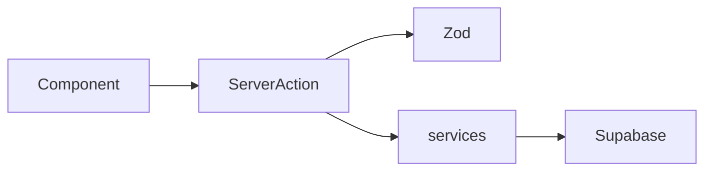

# AnexaPress

**Developer:** Ivan Bondaruk, SaaS Expert  
**Idea author:** Yurii Stefanenko

Multi-tenant reference SaaS template for building B2B products that need workspaces, roles, invitations, and granular permission control.

**Stack:** Next.js 16 · React 19 · TypeScript · Supabase · Zod · Tailwind CSS 4 · shadcn/ui · Fumadocs

---

## SaaS Idea

**AnexaPress** is a production-ready platform layer for teams shipping B2B SaaS. It gives you multi-tenant workspaces, onboarding, team management, and a permission-based access system (PBAC) out of the box — so you can focus on your product domain instead of rebuilding tenancy and access control.

Each workspace has an owner, a URL slug, and isolated data enforced by Postgres Row Level Security. Members join via email invitation or an 8-character join code. Roles map to atomic permission slugs; individual members can receive custom permission overrides when needed.

Authenticated users work inside `/{workspaceSlug}/dashboard`. The public marketing site, product documentation, and help center ship with the template.

---

## Target audience

Teams building B2B SaaS that need:

- Workspace (tenant) management with ownership and onboarding
- Team members, roles, and fine-grained permissions (PBAC)
- Email invitations and shareable join links
- In-app notifications with realtime delivery
- A documented, extensible codebase to layer domain features on top of

---

## Key capabilities

- **Multi-tenancy** — workspace with owner, slug-based routing at `/{workspaceSlug}/dashboard`
- **Onboarding gate** — profile and workspace setup for new users before full dashboard access
- **PBAC** — atomic permission slugs (`workspace.*`, `members.*`, `roles.*`, `content.*`) linked to roles via `role_permissions`
- **Team management** — member list, email invites, 8-character join codes, role assignment
- **Custom member permissions** — per-member overrides via `workspace_member_permissions`
- **Ownership transfer** — initiate and accept workspace ownership handoff
- **In-app notifications** — invite and transfer events with Supabase Realtime
- **Auth** — Supabase Auth (email/password, Google, GitHub OAuth)
- **Profile & account** — avatar in Storage, linked accounts, account deletion
- **Workspace settings** — name, slug, logo, timezone, onboarding goals
- **Product docs** — Fumadocs MDX site at `/docs` (subdomain-aware)
- **Observability** — GlitchTip (Sentry-compatible) error reporting, Firebase Performance Monitoring

---

## Tech stack

| Layer | Technology |
|-------|------------|
| Frontend | Next.js 16 (App Router), React 19, TypeScript, Tailwind CSS 4, shadcn/ui (Radix), Lucide Icons |
| Backend | Supabase (Auth, PostgreSQL, Storage, Realtime) |
| Validation | Zod |
| Documentation | Fumadocs (MDX) |
| Path alias | `@/*` → project root |

---

## Main features

### Authentication and profile

- Supabase Auth: email/password sign-up and sign-in, Google and GitHub OAuth
- User profile: name, avatar (Supabase Storage), country, mobile, date of birth
- Linked accounts management and account deletion
- Terms and privacy acceptance tracking on `profiles`

### Workspaces and multi-tenancy

- Each workspace has an `owner_id`, unique `slug`, and optional logo
- First workspace is created during onboarding (`create_workspace_with_owner` RPC seeds Owner role and membership)
- Users with no workspace are guided through onboarding inside the dashboard layout
- Legacy `/dashboard` redirects to the user's active workspace URL
- Workspace switcher for users in multiple workspaces

### Roles and members

System roles created per workspace: **Owner**, **Admin**, **Editor**, **Publisher**, **Translator**, **Viewer**.

Access is controlled by PBAC:

- Permission slugs stored in `permissions`, linked to roles via `role_permissions`
- UI groups permissions by category (Workspace, Members, Roles, Content) in the role editor
- Backend checks use the same slug set via `has_workspace_permission()` RPC and RLS policies
- Per-member custom overrides stored in `workspace_member_permissions`

Default permission keys:

| Group | Slugs |
|-------|-------|
| Workspace | `workspace.read`, `workspace.update`, `workspace.transfer` |
| Members | `members.invite`, `members.remove` |
| Roles | `roles.create`, `roles.update`, `roles.delete` |
| Content | `content.create`, `content.publish`, `content.translate` |

### Invitations

- **Email invite** — invite by email with role assignment; recipient accepts or declines in-app
- **Join link** — shareable URL with 8-character code: `/{workspaceSlug}/invite?code=XXXXXXXX`
- Pending join codes are preserved across auth redirects via middleware cookie handling

### Notifications

- In-app notification center at `/{workspaceSlug}/dashboard/mail`
- Workspace invite and ownership-transfer notifications
- Supabase Realtime subscription for live updates
- Accept / decline actions from the notification UI

### Account settings

- **Profile** — personal information, avatar upload, linked accounts
- **Notifications** — preferences UI (account-level settings page)
- Workspace-scoped settings: general (name, slug, logo, timezone), team, roles

---

## Project structure

```
anexapress/
├── package.json
├── .env.example
├── next.config.ts
├── middleware.ts
├── app/                         # App Router: pages and API
│   ├── (landing)/               # Marketing: home, pricing, help, changelog, contact
│   ├── [workspaceSlug]/         # Tenant routes
│   │   ├── dashboard/           # /{slug}/dashboard/* (team, mail, settings)
│   │   └── invite/              # Join via code
│   ├── login/                   # Sign-in and sign-up
│   ├── docs/                    # Fumadocs product documentation
│   └── api/                     # API routes (e.g. docs search)
├── actions/                     # Server Actions (auth, workspace, team, onboarding)
├── services/                    # Business logic, Supabase access
├── schemas/                     # Zod validation schemas
├── types/                       # TypeScript types
├── lib/                         # Auth, routing, Supabase clients, permissions
├── components/                  # Shared UI (dashboard, landing, docs, shadcn)
├── content/docs/                # Fumadocs MDX documentation source
├── hooks/                       # Realtime notifications, team management
└── supabase/
    ├── config.toml
    └── migrations/              # SQL migrations (squashed init + archive/)
```

### Structure and conventions

- **Routing** — use helpers from `lib/routing/workspace-paths.ts` (`workspacePath`, `DASHBOARD_ENTRY_PATH`) instead of hardcoding URLs
- **Data access** — server logic in `services/`; Row Level Security on all tables; client uses only the anon key
- **Mutations** — `actions/` decode input, validate with Zod, call `services/`, return UI-friendly results
- **Schema changes** — only via SQL migrations in `supabase/migrations/`; do not alter schema through the Supabase Dashboard
- **Middleware** — session refresh, dashboard route protection, docs subdomain redirect, invite code handling

---

## Architecture

**Typical mutation flow**

```
Component → action (Zod) → service → Supabase
```

**Typical server render flow**

```
layout/page (RSC) → service → pass data to client components
```



Layer responsibilities:

| Folder | Role |
|--------|------|
| `app/` | Pages, layouts, API route handlers |
| `components/` | Presentational UI; no direct DB access |
| `actions/` | Server Actions — validate, call services, return result |
| `services/` | Business logic, Supabase queries, external APIs |
| `schemas/` | Zod validation schemas |
| `types/` | TypeScript entity and DTO types |
| `lib/` | Shared utilities, clients, routing, auth helpers |

---

## Prerequisites

- **Node.js** 22+ (see `engines` in `package.json`)
- **npm** (or pnpm / yarn / bun)
- **Supabase** project (hosted recommended for Storage uploads)

Optional:

- **Firebase** project — client-side analytics and performance monitoring
- **GlitchTip** (or Sentry-compatible) — error reporting and source map uploads

---

## Getting started

### 1. Install and environment

```bash
git clone <repository-url>
cd anexapress
npm install
```

Copy the environment template:

```bash
cp .env.example .env.local
```

Set variables in `.env.local`:

| Variable | Description |
|----------|-------------|
| `SUPABASE_URL` | Supabase project URL (Dashboard → Project Settings → API) |
| `SUPABASE_ANON_KEY` | Supabase anon (public) key |
| `SUPABASE_SERVICE_ROLE_KEY` | Service role key — server-only, never expose to the client |
| `NEXT_PUBLIC_SITE_URL` | Apex / marketing URL label (e.g. `http://localhost:3000` or `https://your-domain.com`) |
| `NEXT_PUBLIC_PLATFORM_URL` | Platform SaaS URL (e.g. `http://platform.localhost:3000` or `https://platform.your-domain.com`) |
| `PLATFORM_HOST` | Platform hostname for proxy routing (e.g. `platform.localhost`) |
| `APEX_HOST` | Apex hostname that redirects to platform (e.g. `localhost` in dev, `your-domain.com` in prod) |
| `NEXT_PUBLIC_DOCS_URL` | Docs site URL (e.g. `http://docs.localhost:3000`) |
| `DOCS_HOST` | Docs hostname for proxy (e.g. `docs.localhost`) |
| `FIREBASE_*` | Firebase web config for analytics/performance (optional) |
| `SENTRY_DSN` | GlitchTip DSN for error reporting (optional) |
| `SENTRY_AUTH_TOKEN` | Build-time token for source map upload (optional) |

`NEXT_PUBLIC_SUPABASE_*`, `NEXT_PUBLIC_FIREBASE_*`, and `NEXT_PUBLIC_SENTRY_DSN` are derived from the non-public variables in `next.config.ts` — set only the server-side names above.

Use the `NEXT_PUBLIC_` prefix only for values the browser may read; never expose `SUPABASE_SERVICE_ROLE_KEY` on the client.

### 2. Database (Supabase)

**Option A — Hosted Supabase (recommended)**

1. Create a project in the Supabase Dashboard.
2. Copy URL, anon key, and service role key into `.env.local`.
3. Link and push migrations:

```bash
npx supabase link --project-ref <your-project-ref>
npx supabase db push
```

Hosted Storage avoids local filesystem issues (e.g. extended attributes on macOS).

**Option B — Local Supabase**

```bash
supabase start
supabase db reset
```

Copy the local API URL and anon key from `supabase status` into `.env.local`.

### 3. Run the app

```bash
npm run dev
```

Open [http://platform.localhost:3000](http://platform.localhost:3000) when platform env vars are set, or [http://localhost:3000](http://localhost:3000) otherwise. Sign up at `/login?mode=signup`. Complete onboarding to create your first workspace.

### 4. Verify after launch

- Open `/{workspaceSlug}/dashboard` — team and settings cards
- **Team** — invite a member, assign a role
- **Mail** — check in-app notifications for invite events
- **Settings** — update workspace name, slug, logo, timezone
- **Docs** — open `/docs` or your configured docs subdomain

### 5. Troubleshooting

| Issue | Action |
|-------|--------|
| Storage upload fails on local macOS | Use a hosted Supabase project and `npx supabase db push` |
| Schema out of sync | Apply only SQL migrations from `supabase/migrations/`; do not edit schema in the Dashboard |
| Auth redirect loops | Ensure `NEXT_PUBLIC_PLATFORM_URL` (or `NEXT_PUBLIC_SITE_URL`) matches your dev URL; add the same origin to Supabase redirect URLs |
| Avatar upload "Bucket not found" | Apply migrations (`npx supabase db push`) so the `avatars` storage bucket exists |

---

## Scripts

| Command | Description |
|---------|-------------|
| `npm run dev` | Start Next.js development server |
| `npm run build` | Build Fumadocs MDX + production Next.js build |
| `npm run start` | Start production server |
| `npm run lint` | Run ESLint |
| `npm run lint:fix` | ESLint with auto-fix |
| `npm run format` | Prettier write |
| `npm run format:check` | Prettier check |

---

## Documentation

| Resource | Location |
|----------|----------|
| Product docs (Fumadocs) | `/docs` — Getting started, Workspaces, Account |
| Help center | `/help` |
| Changelog | `/changelog` |
| Architecture rules | [`.cursor/rules/Project-folders.mdc`](.cursor/rules/Project-folders.mdc) |
| Docs source | [`content/docs/`](content/docs/) |

---

## Deployment

Build and start:

```bash
npm run build
npm run start
```

Set all production environment variables on the host:

| Variable | When | Description |
|----------|------|-------------|
| `SUPABASE_URL` | Build + Runtime | Required for client bundle via `next.config.ts` |
| `SUPABASE_ANON_KEY` | Build + Runtime | Public anon key |
| `SUPABASE_SERVICE_ROLE_KEY` | Runtime only | Server-side admin operations |
| `NEXT_PUBLIC_SITE_URL` | Runtime | Apex / marketing URL label |
| `NEXT_PUBLIC_PLATFORM_URL`, `PLATFORM_HOST`, `APEX_HOST` | Runtime | Platform subdomain (full SaaS app) |
| `NEXT_PUBLIC_DOCS_URL`, `DOCS_HOST` | Runtime | Docs subdomain |
| `SENTRY_DSN`, `SENTRY_AUTH_TOKEN` | Optional | Error reporting and source maps |
| `FIREBASE_*` | Optional | Analytics and performance |

### Production domains (example)

Point all hostnames at the same deployment:

| DNS record | Target |
|------------|--------|
| `platform.your-domain.com` | Your hosting (CNAME or A) |
| `your-domain.com` | Same hosting (apex redirects to platform) |
| `docs.your-domain.com` | Same hosting (docs subdomain) |

Example production env:

```env
NEXT_PUBLIC_SITE_URL=https://your-domain.com
NEXT_PUBLIC_PLATFORM_URL=https://platform.your-domain.com
PLATFORM_HOST=platform.your-domain.com
APEX_HOST=your-domain.com
NEXT_PUBLIC_DOCS_URL=https://docs.your-domain.com
DOCS_HOST=docs.your-domain.com
```

### Supabase Auth URLs

In **Supabase Dashboard → Authentication → URL Configuration**:

| Setting | Value |
|---------|--------|
| Site URL | `https://platform.your-domain.com` |
| Redirect URLs | `https://platform.your-domain.com/auth/callback` |
| Redirect URLs (local dev) | `http://platform.localhost:3000/auth/callback` |

Auth cookies are scoped to the platform host; the apex domain only redirects and does not need a session.

Ensure Supabase migrations are applied before going live. Source maps are uploaded to GlitchTip in production builds when `SENTRY_AUTH_TOKEN` is set.

The app builds successfully without Supabase env vars (placeholders are used during `npm run build`). Provide real values at runtime.

---

## Development notes

- **Database schema** — all changes only via SQL migrations in `supabase/migrations/`
- **Historical migrations** — incremental history archived in `supabase/migrations/archive/`
- **Code quality** — ESLint + Prettier (`eslint.config.mjs`, `.prettierrc.json`); TypeScript strict mode; Zod for user-facing inputs in Server Actions

---

## Security notes

- Never commit `.env.local` or real API keys
- `SUPABASE_SERVICE_ROLE_KEY` is **server-only**
- Row Level Security (RLS) enforces workspace-scoped data access in Postgres
- Permission checks run in both RLS policies and application-layer RPC helpers

---

## License

Private — all rights reserved unless otherwise specified by the repository owner.
