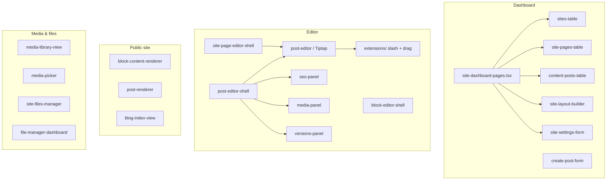
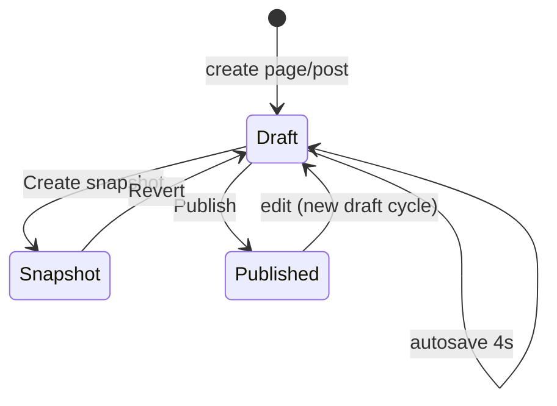

# components/cms — CMS UI layer

React components: **dashboard**, **editor**, **public render**, **media**, **files**.

Data flows only through Server Actions and RSC wrappers in `content-pages.tsx` / `site-dashboard-pages.tsx`.

---

## Component map



---

## RSC entry points

| File | Exports | app/ routes |
| ---- | ------- | ----------- |
| `content-pages.tsx` | `ContentListPage`, `ContentNewPage`, `ContentEditorPage` | `.../content/*` |
| `site-dashboard-pages.tsx` | `SitesListPage`, `SitePagesListPage`, `SiteLayoutPage`, … | `.../sites/[siteId]/*` |
| `editor-pages.tsx` | fullscreen editor pages | `.../editor/*` |

Pattern: auth → `resolveWorkspaceFromRoute` → service → presentational component.

---

## Editor



| Part | File |
| ---- | ---- |
| Tiptap root | `editor/post-editor.tsx` |
| Shell + autosave | `editor/post-editor-shell.tsx`, `site/site-page-editor-shell.tsx` |
| Editor layout | `editor/block-editor-shell.tsx`, `editor-workspace-layout.tsx` |
| Slash menu | `editor/extensions/index.ts` |
| Drag & drop | `extensions/cms-drag-handle.ts`, `block-move-animation.ts` |
| Bubble toolbar | `selectors/link-selector`, `color-selector`, `node-selector`, `text-buttons` |
| Sidebar tabs | `block-editor-sidebar.tsx` |

Stack: **Novel** + **Tiptap**, styles in `app/prosemirror.css`.  
Images: `cms-image-resizer.tsx`, upload via `lib/cms/editor-image-upload.ts`.

---

## Public render

| Component | When |
| --------- | ---- |
| `renderer/block-content-renderer.tsx` | Pages, home |
| `renderer/post-renderer.tsx` | Blog post |
| `public/blog-index-view.tsx` | Feed / blog_index home |

Site shell: `components/site-shell/` (header/footer from `site_layouts`).

---

## Folder structure

```
editor/          # Tiptap, panels, extensions, selectors
site/            # settings, page tables, domains, layout builder
renderer/        # Tiptap → React for visitors
media/           # library, picker
files/           # file-manager UI
content-pages.tsx
site-dashboard-pages.tsx
editor-pages.tsx
create-post-form.tsx
content-posts-table.tsx
```

---

## Server Actions (called from client)

| Action file | Operations |
| ----------- | ---------- |
| `actions/post/post.actions.ts` | create, saveDraft, publish, snapshot, revert, delete |
| `actions/site/site.actions.ts` | site CRUD, pages, layout, domains, files |
| `actions/media/media.actions.ts` | upload, list, delete media |

All inputs validated with Zod in `schemas/post.schema.ts`, `site.schema.ts`, `seo.schema.ts`.

---

## Services (read from RSC, not from client)

`post.service.ts` · `site.service.ts` · `site-page.service.ts` · `site-layout.service.ts` · `site-domain.service.ts` · `site-file.service.ts` · `media.service.ts`

---

## Providers

| Provider | Role |
| -------- | ---- |
| `site-dashboard-provider.tsx` | active `siteId`, sidebar context |
| `editor-chrome-context.tsx` | fullscreen editor header |
| `editor-scroll-context.tsx` | scroll container for drag-handle |

---

## Extending

**New block:** `extensions/index.ts` → `buildSuggestionItems` + `block-content-renderer.tsx` + `block-registry.ts`.

**New dashboard section:** page in `app/.../sites/[siteId]/` + function in `site-dashboard-pages.tsx` + `SiteDashboardSection` in `site-dashboard-paths.ts`.

---

## PR checklist

- [ ] Zod in action, logic in service
- [ ] `sanitizeTiptapContent` on write path
- [ ] Public RSC reads published content only
- [ ] `revalidatePath` after publish
- [ ] `content.create` / `content.publish` enforced on UI and server

---

## Related docs

- Product overview: [`../../README.md`](../../README.md)
- lib layer: [`../../lib/cms/README.md`](../../lib/cms/README.md)
- End users: [`../../content/docs/cms/`](../../content/docs/cms/)
