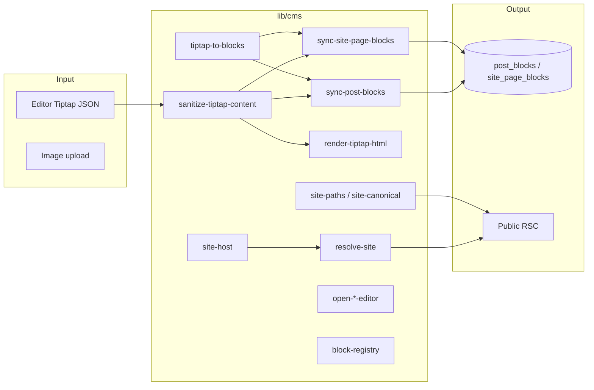

# lib/cms — CMS infrastructure

Utilities between the **editor**, **services**, and **public render**. No UI, no direct calls from components (except editor helpers).

---

## Module map



| File | Purpose |
| ---- | ------- |
| `sanitize-tiptap-content.ts` | Sanitize JSON before persist and render |
| `tiptap-to-blocks.ts` | Tiptap doc → flat `*_blocks` rows |
| `sync-post-blocks.ts` | Sync post blocks after save |
| `sync-site-page-blocks.ts` | Same for pages |
| `render-tiptap-html.ts` | HTML from JSON (SSR/export) |
| `render-extensions.ts` | Shared extension helpers |
| `resolve-site.ts` | Site by `workspaceSlug` + `siteSlug` |
| `site-host.ts` | Resolve site by Host (custom domain) |
| `site-paths.ts` | `buildSiteBasePath()` |
| `site-canonical.ts` | Canonical URL for SEO |
| `post-mappers.ts` / `site-mappers.ts` | Row → types |
| `parse-seo-snapshot.ts` | SEO from version `seo_snapshot` |
| `editor-insert-helpers.ts` | Insert atom blocks in editor |
| `editor-image-upload.ts` | Upload → `media_files` |
| `editor-scroll-container.ts` | Scroll container for drag-handle |
| `editor-block-tree.ts` | Block tree for outline |
| `move-editor-block.ts` | Move blocks |
| `open-post-editor.ts` | Post editor URL |
| `open-site-page-editor.ts` | Page editor URL |
| `site-file-manager-stats.ts` | Aggregates for file dashboard |
| `content-typography.ts` | Public content typography classes |
| `block-registry.ts` | Custom React block registry (extension) |

---

## Critical paths

### Save draft

```
PostEditorShell.onChange
  → saveDraftAction
  → post.service.saveDraft
  → sanitizeTiptapContent(content)
  → UPDATE post_versions
  → syncPostBlocks(postId, versionId, content)
```

Pages follow the same flow via `sync-site-page-blocks.ts`.

### Public page

```
getSiteBySlug (resolve-site)
  → getPublishedSitePage (service)
  → sanitizeTiptapContent
  → BlockContentRenderer
```

### Custom domain

```
Request Host
  → site-host.ts
  → site_domains + sites
  → ResolvedSiteByDomain
```

---

## Rules

1. **Always** run user JSON through `sanitizeTiptapContent` before persist and render.
2. After changing `content` on a version, call the matching `sync*Blocks`.
3. Build public URLs with `buildSiteBasePath` / `site-canonical` — do not concatenate strings in components.
4. New block type: extension in `components/cms/editor` + renderer in `renderer/` + optional `BLOCK_REGISTRY`.

---

## Related READMEs

- [`components/cms/README.md`](../../components/cms/README.md) — UI, routes, editor
- [`../../README.md`](../../README.md) — product overview
